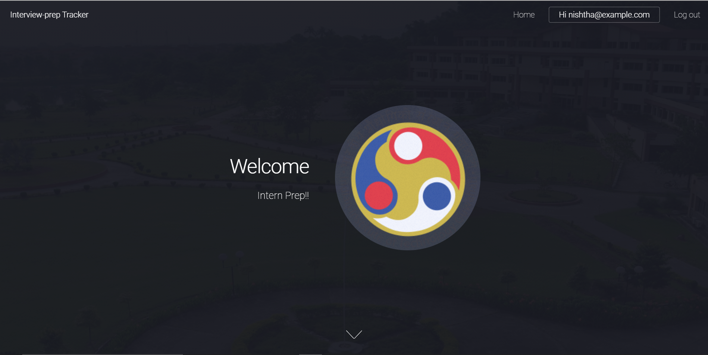
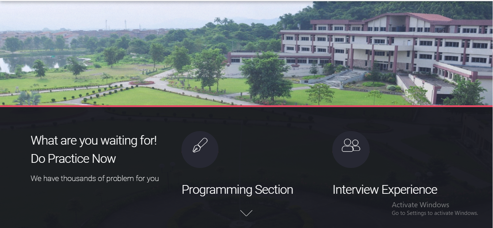
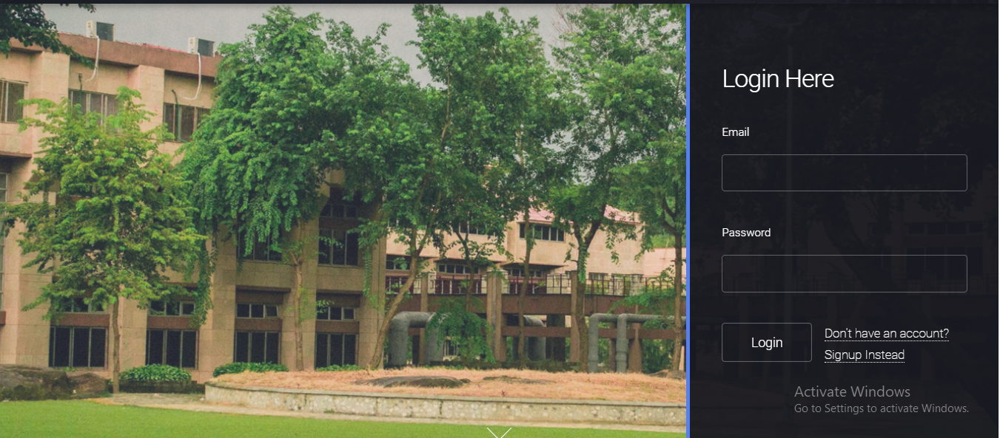
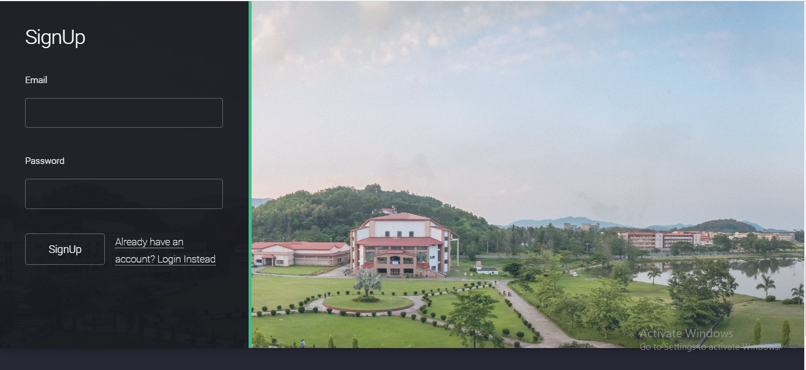
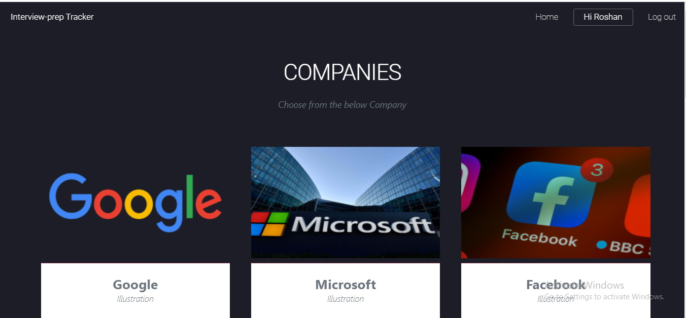
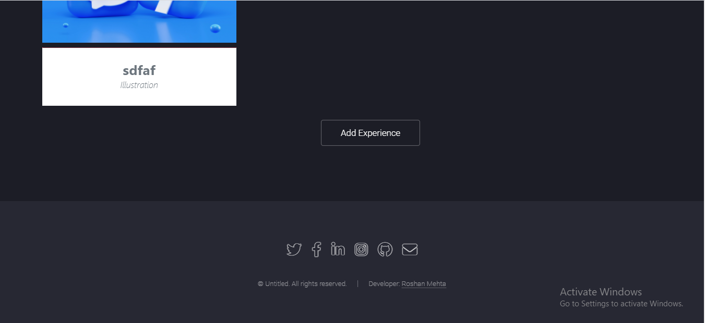

# Interview-Tracker (Coding Club Project)
Intern season/placements getting closer?
Wanna know how to prepare for it?
Don't worry we got ya all covered.

### Welcome Page

 

### Section Page

Programming section- practice all you can before the real exam. 
Interview section- a sneak peak into your senior's experience.
 

### Login Page

### Sign up Page

### Companies that you like!!

### Interview experience of your chosen companies 

### Add your experience as well

## Wanna know more? Visit the website

